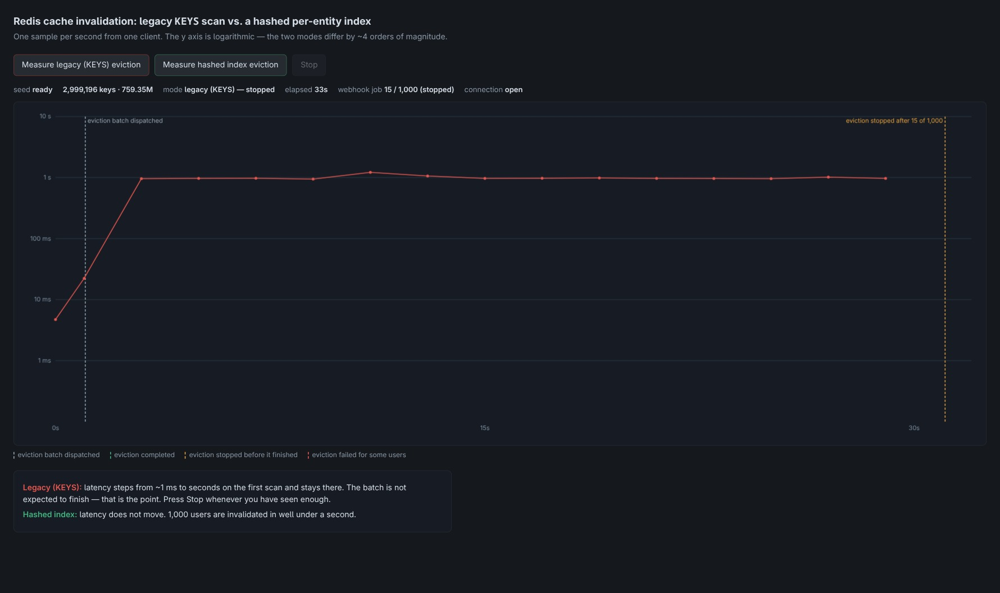
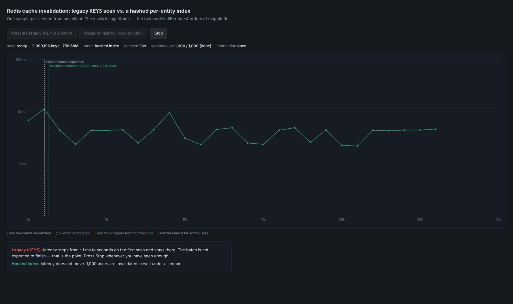

# redis-hash-index

Two ways to invalidate a Redis cache, measured under load, against one Redis.
Despite the repository name, the per-entity index is a Redis **SET**, not a HASH.

- **v1 — the legacy path.** For each user, scan the whole keyspace with `KEYS *::<userId>::*`
  to find their cache keys, then delete the matches. O(N) per user, N = every key in Redis.
- **v2 — a per-entity index.** Keep one small Redis set per user listing its cache keys
  (`entityIndex::demo::activeSubscription::<userId>`). Read the set, delete what it lists,
  `SREM` the names you read. O(k) per user, independent of keyspace size.

The interesting part is not how long each takes. It is what happens to **everybody else** while
it runs, because Redis executes commands on a single thread. `KEYS` over a few million keys holds
that thread for seconds, and every other client — including ones doing nothing but a single `GET` —
waits behind it.

---

## 1. What this shows

Four Express services and one Redis, each in its own container:

```
                     ┌──────────────┐
   browser ─────────►│  benchmark   │ :3000   UI + WebSocket + seeder + run driver
                     └───┬──────┬───┘         (the bulk seed writes Redis directly)
     1 poll/sec and      │      │  batch of user IDs
     the lazy fills      │      └───────────────────┐
                     ┌───▼──────────┐        ┌──────▼───────┐
                     │   test-api   │ :3001  │   webhook    │ :3002
                     └───┬──────┬───┘        └──────┬───────┘
                         │      │ HTTP, on a miss   │
                         │  ┌───▼──────────┐        │
                         │  │ mock-billing │ :3003  │   the fake billing provider, no Redis
                         │  └──────────────┘        │
                         │ read · fill              │ delete
                         └────────────┬─────────────┘
                                      ▼
                               ┌─────────────┐
                               │    redis    │ :6379   single instance, noeviction
                               └─────────────┘
```

`test-api` is the innocent bystander. It has its **own** Redis connection and never scans. When
the webhook starts a v1 scan, `test-api` gets slower — not because it did anything, but because it
is queued behind a command that holds the server. That is the whole demonstration, and it only
shows because the victim and the perpetrator are genuinely separate processes.

`mock-billing` is the fake third party the cache sits in front of. The fill chain is
`benchmark → test-api → mock-billing`: a cache miss in `test-api`'s `@Cache` calls `mock-billing`
over HTTP and writes the answer to Redis, so `test-api` is the only service writing cache keys
through the decorator.

## 2. Quick start

Requires Docker and `make`. (`node` on the host is used only by `make up`'s seed step and `make verify`.)

```bash
make up                 # build, wait for health, seed the fixture (default 2M records, ~1 min, ~700 MB)
open http://localhost:3000
```

`make up` seeds automatically and streams live progress; it skips seeding if the fixture is already
there. Re-seed a running stack with `make seed` (or `make seed FORCE=1` to overwrite an existing
fixture).

Then press one of the two buttons and watch the chart. Press **Stop** when you have seen enough.

## 3. What each run should look like

The y axis is **latencyMs on a log scale** — the two modes differ by about four orders of
magnitude and a linear axis makes v2 invisible. A grey dashed line marks the moment the eviction
batch was dispatched; a second dashed line marks the moment the webhook job ended, coloured by how:
green *completed*, amber *stopped*, red *failed*.

**Measure hashed index eviction (v2)**. The latency line does not move.
A thousand users are invalidated in well under a second. The chart is boring, which is the
argument. The dispatch and completion lines are almost on top of each other — the second label drops
to its own row so both stay legible.

**Measure legacy (KEYS) eviction (v1)**. At the full 2M+ fixture the
latency line steps from about a millisecond to ~2 seconds on the very first scan and stays there,
one step per user. The webhook `processed` counter crawls; its rate depends on the fixture and host.
You will normally see the amber *eviction stopped after N of 1,000* line where you pressed Stop,
because a thousand keyspace scans is not something you wait out: the fast run has a completion
line, the slow one has the line you drew when you gave up.

Actual browser captures from the default fixture (`SEED_KEYS=2000000`, seed 1, 1,999,196 cache
records plus 1,000,000 index sets), taken on September 14, 2026 (UTC):





These are single runs on this development host, not the reference-machine timings below.
The legacy run was stopped early; the fixture was reseeded before the indexed run.

The older [legacy](docs/run-legacy.json) and [indexed](docs/run-index.json) WebSocket captures
use `SEED_KEYS=50000`. At that smaller scale they show job progress but not the large-fixture
latency rise. Regenerate captures with
`node scripts/capture-run.mjs <v1|v2> <seconds> <outfile>` against a running, seeded stack.

## 4. Costs

Roughly **350 MB per million cache records** including indexes:

| `SEED_KEYS` | memory | seed time | notes |
|---|---|---|---|
| 50,000 | ~40 MB | ~1 s | what `make verify` uses |
| 2,000,000 (default) | ~700 MB | ~1 min | the demo fixture |
| 10,000,000 | ~3.3 GB | several minutes | the full run |

```bash
SEED_KEYS=10000000 make up
```

The fixture is deterministic from `SEED_VALUE` (default `1`): the same seed produces byte-identical
keys and values, and nothing large lives in git.

### Seeding environment

Set these in the shell before `make up`. Compose forwards them to the service in the last column.
`SEED_VALUE` reaches both `benchmark` and `mock-billing`; the seeder refuses a lazy fill, naming
both values, if they differ. `SEED_MODE` and `SEED_KEYS` set before `make seed` also override the
running container for that one seed.

| Variable | Default | What it does | Service |
|---|---|---|---|
| `SEED_KEYS` | `2000000` | Cache records to write | benchmark |
| `SEED_VALUE` | `1` | Fixture seed. Must match between the two services | benchmark, mock-billing |
| `SEED_MODE` | `bulk` | `bulk` pipelines ~20k commands per round trip. `lazy` requests every record from `test-api`, which fills it through `@Cache` from `mock-billing` | benchmark |
| `LAZY_CONCURRENCY` | `16` | Concurrent HTTP fills in the lazy phases | benchmark |
| `LAZY_MAX_KEYS` | `50000` | `lazy` refuses a larger `SEED_KEYS`, and the error names this flag. At 2M, a lazy fill takes hours | benchmark |
| `LAZY_WARM_USERS` | `1000` | In both modes, users `u_0000000…` (the eviction batch) are filled through the chain as a final `lazy-warm` phase | benchmark |
| `BILLING_TIMEOUT_MS` | `5000` | `test-api`'s timeout for each call to `mock-billing`. A timeout is a 502 and caches nothing | test-api |
| `ORIGIN_LATENCY_MS` | `0` | Delay before each `mock-billing` answer (0..60000) | mock-billing |
| `ORIGIN_FAIL_USER` | — | A user ID `mock-billing` always answers 503 for. `test-api` returns 502 and caches nothing | mock-billing |

Ports: `benchmark` 3000, `test-api` 3001, `webhook` 3002, `mock-billing` 3003, Redis 6379.

```bash
SEED_MODE=lazy SEED_KEYS=50000 make reset seed   # same DBSIZE and bytes as a bulk seed of that size
```

## 5. Why the legacy run does not finish

One thousand users, one full keyspace scan each, is roughly **35 minutes at 2M records** and about
**3 hours at 10M**. A 1000-user v1 batch is **not meant to finish** — watch the graph for twenty
seconds, then press **Stop**. Both eviction endpoints return `202` immediately and run the work in
the background precisely so a demo nobody can wait for does not also hang the browser.

Reference numbers (2-core Xeon, Redis 7.0.15, loopback, two counterbalanced trials per row — full
method in [docs/BENCHMARK-BASELINE.md](docs/BENCHMARK-BASELINE.md)):

| cached values | total keys | `KEYS` median | index median | competing `GET` during `KEYS` |
|---|---|---|---|---|
| 1,000,002 | 1,166,669 | 987 ms | 0.107 ms | **987 ms** |
| 2,000,004 | 2,333,338 | 2,309 ms | 0.095 ms | **2,291 ms** |
| 8,570,004 | 9,998,338 | 10,957 ms | 0.095 ms | **10,937 ms** |

The last column is the point: an unrelated client doing nothing but `GET` waits out the entire
scan.

## 6. Caveats, stated plainly

- One sample per second from one client is enough to show a step change of four orders of
  magnitude. It is **not** a latency distribution.
- The scanned keyspace includes the index keys, so v1 traverses slightly more than a cache with no
  index would. A fair same-fixture comparison, not identical to a greenfield legacy system.
- Loopback and a single Redis instance, no replication or clustering. The multi-key `UNLINK` and
  the pipelines here would need slot-aware routing on Redis Cluster.
- Redis runs with `--maxmemory-policy noeviction`. If it evicted the fixture the keyspace would
  shrink, the scan would speed up, and the benchmark would quietly start lying.
- The seeder uses the shared transactional `registerMany()` writer. Pruning is available but
  not scheduled; fixture index sets expire after one hour. See the
  [registration and maintenance policy](docs/ARCHITECTURE.md#registration-and-maintenance-policy).
- The demo fills the cache as well as evicting it: `test-api`'s `GET /subscription/:userId` is a
  read-through through `@Cache`. Its origin, `mock-billing`, is a real service behind a network hop
  but fake and deterministic in content, and a fill racing an invalidation gives bounded staleness, not atomicity — see
  [read path](docs/ARCHITECTURE.md#read-path).
- Webhook v2 deliberately processes one entity at a time for precise progress and Stop behavior.
  Failed IDs are reported in `incomplete` for targeted retries; see [the job API](docs/API.md).

## 7. Documentation

| Document | What's in it |
|---|---|
| [docs/REDIS-SCHEMA.md](docs/REDIS-SCHEMA.md) | Key formats and both invalidation paths — the contract every service shares |
| [docs/API.md](docs/API.md) | Endpoint contracts for all four services |
| [docs/ARCHITECTURE.md](docs/ARCHITECTURE.md) | Why the services are split this way |
| [docs/BENCHMARK-BASELINE.md](docs/BENCHMARK-BASELINE.md) | Reference measurements and method |
| [docs/run-index.jpg](docs/run-index.jpg) · [docs/run-legacy.jpg](docs/run-legacy.jpg) | Live browser captures with the default 2M fixture |
| [docs/run-index.json](docs/run-index.json) · [docs/run-legacy.json](docs/run-legacy.json) | Captured WebSocket frames from each run |
| [tasks/](tasks/) | The eight build stories, in full |

## 8. Verify it yourself

```bash
make verify
```

Brings the stack up, seeds `SEED_KEYS=50000`, starts a **v2** run end to end, waits for the
webhook job to reach `done`, then asserts:

- every cache key **and** index key for the 1000 batch users is gone,
- an untouched control user still has its cache,
- `DBSIZE` dropped by exactly the number of keys those users owned,
- a bulk-seeded user, invalidated and refilled through `test-api → mock-billing`, stores values
  byte-identical to the bulk seed,

and `docker compose down -v` afterwards. It exits non-zero on any failure.

```bash
make typecheck && make test        # tsc --noEmit and the test suites, all against a real Redis
```

## How this was built

With the [Ralph](https://github.com/snarktank/ralph) technique: a bash loop that starts a fresh
agent with clean context on each iteration, pointed at `prd.json`, working one story at a time and
committing as it goes.

```bash
./ralph.sh --tool claude 20
```

Each iteration reads `prd.json`, picks the highest-priority story where `passes: false`, reads the
matching `tasks/US-XXX.md` for the full specification, implements it, runs that file's self-check
block, commits, sets `passes: true`, and appends what it learned to `progress.txt`. The loop exits
when every story passes.

| File | Role |
|---|---|
| `ralph.sh` | The loop. Requires `jq`. |
| `CLAUDE.md` | Instructions handed to each iteration, plus this project's context |
| `prd.json` | The eight stories, their acceptance criteria, and the `passes` flags |
| `tasks/US-*.md` | Full specification and self-check for each story |
| `progress.txt` | Append-only log, with a Codebase Patterns section iterations read first |

Ralph tooling is copied from [snarktank/ralph](https://github.com/snarktank/ralph) (MIT) — its
licence is preserved at [vendor/LICENSE.ralph-MIT](vendor/LICENSE.ralph-MIT).

## Background

This demo accompanies an article on cache invalidation, secondary indexes, and why `KEYS` and
`FLUSHALL` are the same mistake in different clothes.

## Licence

GPL-3.0. See [LICENSE](LICENSE).
